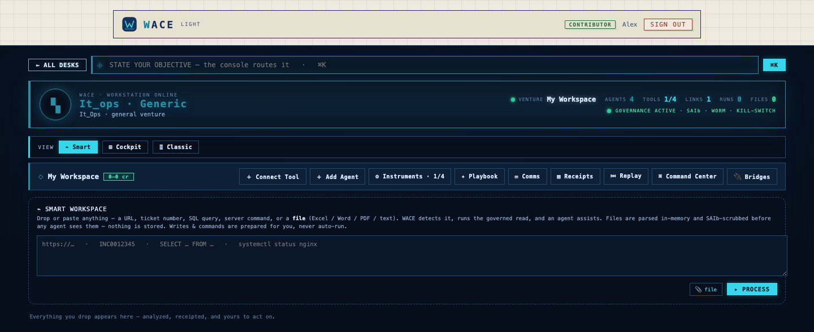

# WACE Light

**The governed AI command environment — open-source, individual edition.**

WACE Light is a single-user, self-hosted AI workspace where you connect your own
tools and your own LLM key, and work alongside a governed AI. Its whole point is
**auditability**: every tool is read-only by default, every prompt is scrubbed of
secrets/PII before it reaches the model, writes go through a human-approval gate,
and **every action is recorded in a tamper-evident (WORM) log** you can replay.

> WACE Light is the individual edition of WACE. The commercial edition adds
> multi-user org management (SSO/SCIM/SAML), team governance, and more.



## Why it's different

- **Bring your own key (BYOK).** Your Anthropic key is sealed at rest with
  AES-256-GCM; agent runs bill to *your* account. No shared cloud middleman.
- **SAIb guard.** PII, secrets, and API keys are masked *before* any text reaches
  the LLM — with a live preview of exactly what gets redacted.
- **Governed connectors.** Web, SQL (read-only), ticketing, mail, and more —
  read-only by default; SSRF-guarded; writes are prepared for you, never fired
  by the AI on its own.
- **Grounded answers.** Agent drafts cite the source lines they're based on, with
  a confidence signal.
- **Provable history.** A WORM receipt for every action + a Session Replay to
  scrub through exactly what was read, drafted, and approved.
- **Kill switch.** One flip halts all autonomy.

## Quickstart

### 1. Backend
```bash
cd backend
python3 -m venv .venv && source .venv/bin/activate
pip install -r requirements.txt

# configure (see ../.env.example)
export AOS_JWT_SECRET=$(python3 -c "import secrets; print(secrets.token_hex(32))")
export AOS_VAULT_KEY=$(python3 -c "import secrets,base64; print(base64.b64encode(secrets.token_bytes(32)).decode())")
export AOS_DB_URL="sqlite:///./wace_light.db"
# optional: export ANTHROPIC_API_KEY=sk-ant-...   (or add your key in-app)

uvicorn src.main:app --reload --port 8000
```

### 2. Frontend
```bash
cd frontend
npm install
npm run dev     # opens the WACE Light console; API proxied to :8000
```

Sign up, walk the short onboarding (connect tools + set your LLM key), and you
land in your console.

## Your AI / BYOK

WACE Light never ships an LLM key. You provide your own:
- Set `ANTHROPIC_API_KEY` in the environment, **or** add your key in-app (it's
  sealed with `AOS_VAULT_KEY` before storage — only a masked hint is ever shown).
- Or run entirely on your Claude subscription via the local `claude` CLI bridge:
  `export AOS_LLM_BACKEND=cli` (requires the `claude` CLI authenticated locally).

## Architecture

- `backend/` — FastAPI over the governed engine: `src/aos/voundry` (connectors,
  agents, ingest, BYOK, onboarding, governance, WORM audit), `src/saib` (the
  redaction guard), `src/llm` (the LLM gateway), `src/core` (kill switch, vault).
- `frontend/` — a React + Vite single-page console.

## License

[AGPL-3.0](./LICENSE). If you run a modified version as a network service, you
must make your source available. For a commercial license, contact the authors.
